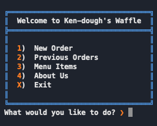
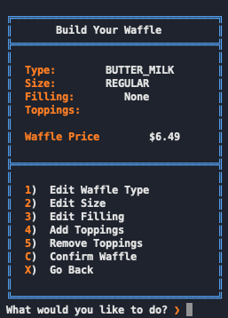
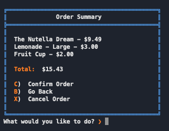
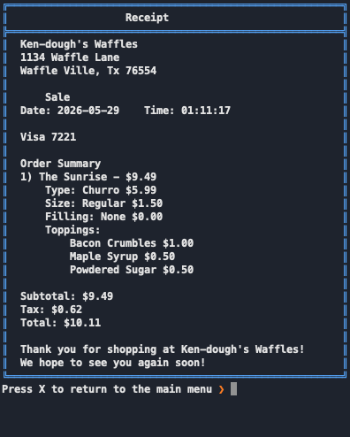

# 🧇 Ken-dough's Waffles

A console-based point-of-sale (POS) application for a waffle shop, built with **Java 17** and **Spring Boot**. Customers can build custom waffles, order signature creations, grab the daily special, add drinks and sides, and check out with an itemized printed receipt. All menu items and inventory are persisted in a **MySQL** database through **Spring Data JPA**, with live stock tracking and availability gating.

This is my **Capstone 2** project for Year Up United.

---

## Table of Contents

- [Features](#features)
- [Screenshots](#screenshots)
- [Tech Stack](#tech-stack)
- [Project Structure](#project-structure)
- [Getting Started](#getting-started)
  - [Prerequisites](#prerequisites)
  - [Database Setup](#database-setup)
  - [Configuration](#configuration)
  - [Running the App](#running-the-app)
- [How It Works](#how-it-works)
- [Menu & Pricing](#menu--pricing)
- [Receipts](#receipts)
- [REST API (Optional)](#rest-api-optional)
- [Class Diagram](#class-diagram)
- [Known Limitations & Future Improvements](#known-limitations--future-improvements)
- [Author](#author)

---

## Features

- **Custom Waffle Builder** — choose your waffle type, size, and filling, then add or remove regular and premium toppings.
- **Signature Waffles** — four chef-designed waffles: The Classic Ken, The Nutella Dream, The Sunrise, and The Red Royale.
- **Daily Special** — a rotating signature waffle that changes based on the day of the week.
- **Drinks** — six flavors, each available in Small, Medium, or Large.
- **Sides** — Hash Browns, Waffle Fries, Bacon, and Fruit Cup.
- **Live Order Management** — view your current order and remove individual items at any time.
- **Checkout & Receipts** — confirm your order, generate an itemized receipt (with subtotal, tax, and total), and save it to disk.
- **Receipt Lookup** — look up a previous order by its four-digit order number.
- **Inventory Tracking** — stock counts are stored in the database and decremented on each sale inside a transaction; items automatically become unavailable when they run out.
- **Styled Console UI** — ANSI colors, bordered menus, and loading transitions for a polished terminal experience.

---

## Screenshots

> 📸 _Add your screenshots to a `docs/screenshots/` folder in the repo and update the links below._

| Main Menu | Build Your Waffle |
|-----------|-------------------|
|  |  |

| Checkout Summary | Printed Receipt |
|------------------|-----------------|
|  |  |

---

## Tech Stack

| Layer | Technology |
|-------|------------|
| Language | Java 17 |
| Framework | Spring Boot |
| Persistence | Spring Data JPA (Hibernate) |
| Database | MySQL |
| Build Tool | Maven (with Maven Wrapper) |
| UI | Console / terminal with ANSI styling |

---

## Project Structure

```
kendoughs-waffles/
├── database/
│   └── kendoughs.sql                # MySQL schema + seed data
├── receipts/                        # Generated order receipts (created at runtime)
├── src/main/java/com/pluralsight/kendoughs_waffles/
│   ├── KendoughsWafflesApplication.java   # Entry point
│   ├── controllers/                 # AppController (console flow) + REST controllers
│   ├── models/
│   │   ├── enums/                   # WaffleType, WaffleSize, FillFlavor, etc.
│   │   ├── interfaces/              # Printable
│   │   └── products/                # Product, Topping, Drink, Side, Waffle, Order...
│   ├── repositories/                # Spring Data JPA repositories
│   ├── services/                    # OrderService (stock updates, business logic)
│   ├── ui/                          # Menus (all console screens)
│   └── util/                        # ConsoleUtilities, UserInput, ReceiptWriter, ReceiptGetter
└── src/main/resources/
    └── application.properties       # DB connection + JPA settings
```

---

## Getting Started

### Prerequisites

- **Java 17** or higher (`java -version`)
- **MySQL 8+** running locally
- **Maven** (or use the included `./mvnw` wrapper — no install needed)

### Database Setup

1. Make sure your MySQL server is running.
2. Import the provided schema and seed data:

   ```bash
   mysql -u root -p < database/kendoughs.sql
   ```

   This creates the `kendoughs` database with all menu items, toppings, and starting inventory.

### Configuration

Open `src/main/resources/application.properties` and update the datasource credentials to match your local MySQL setup:

```properties
spring.datasource.url=jdbc:mysql://localhost:3306/kendoughs
spring.datasource.username=YOUR_USERNAME
spring.datasource.password=YOUR_PASSWORD
```

> 💡 **Tip:** For better security, don't hard-code your password. Reference an environment variable instead:
> ```properties
> spring.datasource.password=${DB_PASSWORD}
> ```
> then set `DB_PASSWORD` in your shell or run configuration.

### Running the App

From the project root:

```bash
./mvnw spring-boot:run
```

(On Windows: `mvnw.cmd spring-boot:run`)

Or open the project in IntelliJ IDEA and run `KendoughsWafflesApplication`.

---

## How It Works

1. **Home Screen** — start a New Order, look up Previous Orders, browse the full Menu, read About Us, or Exit.
2. **Customer Info** — when starting an order, you're prompted for name, email, and phone.
3. **Build Your Order** — add waffles (custom, signature, or the daily special), drinks, and sides.
4. **Review** — view your current order and remove anything you've changed your mind about.
5. **Checkout** — confirm to generate and save a receipt, or cancel out. Stock is decremented from the database on a confirmed sale.

The **daily special** rotates automatically:

| Day | Special |
|-----|---------|
| Monday / Friday | The Classic Ken |
| Tuesday / Saturday | The Nutella Dream |
| Wednesday | The Sunrise |
| Thursday / Sunday | The Red Royale |

---

## Menu & Pricing

A custom waffle's price is the sum of its **type + size + filling + premium toppings**.

**Waffle Types**

| Type | Price |
|------|-------|
| Butter Milk | $4.99 |
| Belgian | $5.49 |
| Liege | $5.99 |
| Churro | $5.99 |
| Red Velvet | $6.49 |

**Sizes** (added to base)

| Size | Price |
|------|-------|
| Mini | +$0.00 |
| Regular | +$1.50 |
| Large | +$3.00 |

**Fillings** — None (free) or a stuffed filling (Nutella, Cream Cheese, Strawberry Jam, Strawberry) at **+$1.50**.

**Toppings**

- **Regular** (Whipped Cream, Powdered Sugar, Maple Syrup, Cinnamon, Butter, Caramel Drizzle) — included
- **Premium** (Nutella, Fresh Strawberries, Bacon Crumbles, Ice Cream, Fresh Blueberries, Cookie Butter) — **+$1.00 each**

**Drinks** — priced by size: Small **$2.00**, Medium **$2.50**, Large **$3.00**
(Coffee, Orange Juice, Milk, Lemonade, Apple Juice, Cranberry Juice)

**Sides**

| Side | Price |
|------|-------|
| Hash Browns | $1.50 |
| Waffle Fries | $1.50 |
| Bacon | $2.00 |
| Fruit Cup | $2.00 |

> Sales tax of **6.5%** is applied at checkout.

---

## Receipts

On checkout, an itemized receipt is written to the `receipts/` folder. Each receipt includes the store header, date/time, order summary, subtotal, tax, and total. Orders can be retrieved later from the **Previous Orders** screen using the four-digit order number printed at checkout.

---

## REST API (Optional)

The app also exposes a small REST layer (Spring Web) for programmatic access to the menu:

| Method | Endpoint | Description |
|--------|----------|-------------|
| GET | `/api/menu/drinks` | Available drinks |
| GET | `/api/menu/sides` | Available sides |
| GET | `/api/menu/toppings` | Available toppings |
| GET | `/api/menu/waffle-types` | Available waffle types |
| GET | `/api/menu/waffle-sizes` | Available waffle sizes |
| POST | `/api/order/submit` | Submit an order and generate a receipt |

---

## Class Diagram

> 📐 Visual Diagram
>
> 
> 
> 

---

## Known Limitations & Future Improvements

- Add input validation for customer email and phone formats.
- Persist completed orders to the database (currently saved as receipt files only).
- Add a manager/admin view for restocking inventory.
- Expand automated test coverage beyond the context-load smoke test.
- Build a web or mobile front end on top of the existing REST API.

---

## Author

**Kendall** — Year Up United, Capstone 2

🧇 _Come hungry. Leave happy. That's the Ken-dough's way._
